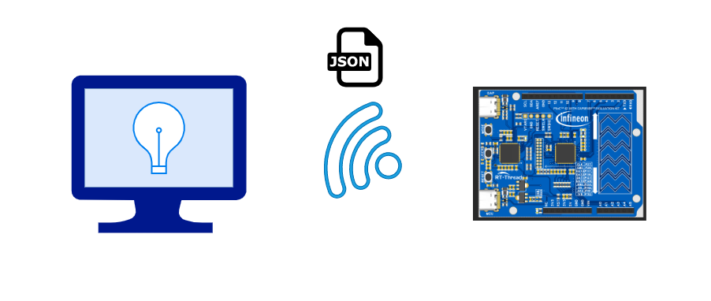

# capsense-remote-controller

本项目设计一个触摸滑条无线遥控器，它是 2024 RT-Thread 全球嵌入式电子设计大赛的项目作品，基于英飞凌（Infineon）PSoC 6 评估板和 RT-Thread 系统实现。

简单来说，MCU 检测 CapSense 触摸滑条传感器，将数值映射成 0-100 范围，然后打包成预定义的 JSON 格式数据，并通过 Wi-Fi 无线网络发送到服务端，实现远程控制，例如调节电脑屏幕的亮度。

